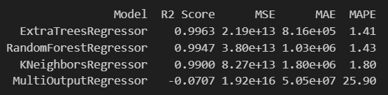

# 🌾 Paddies Yield

**Paddies Yield** is a machine learning-based prediction system integrated with a RESTful FastAPI backend. The system is designed to assist agricultural planning by analyzing soil quality, seasonal factors, and land area to optimize rice production in various districts of Bangladesh.

---

## 📌 Table of Contents

- [Project Overview](#project-overview)
- [Features](#features)
- [Tech Stack](#tech-stack)
- [Data Pipeline](#data-pipeline)
  - [Data Preprocessing](#data-preprocessing)
  - [Feature Engineering](#feature-engineering)
- [Modeling](#modeling)
  - [Model Selection](#model-selection)
  - [Training & Evaluation](#training--evaluation)
- [API Overview](#api-overview)
  - [Input Format](#input-format)
  - [Output Format](#output-format)
- [Performance](#performance)
- [How to Run](#how-to-run)
- [Project Structure](#project-structure)
- [License](#license)

---

## 📖 Project Overview

**Paddies Yield** aims to support decision-making in agriculture by:
- Predicting the concentration of soil nutrients (Nitrogen, Phosphorus, Potassium - NPK) from input data for a particular crop type
- Estimating the maximum possible paddy yield for a given district in Bangladesh based on season and land area.
- Recommending the amount of fertilizer and pesticide required to achieve the maximum predicted yield.

This project leverages real agricultural and environmental datasets and integrates data science with domain expertise in crop production.

---

## 🚀 Features

- Predicts NPK values for soil samples
- Estimates maximum rice yield for districts based on land area and season
- Suggests optimal fertilizer and pesticide amounts
- Clean, modular machine learning pipeline
- RESTful FastAPI backend with interactive Swagger documentation

---

## 🛠 Tech Stack

- **Language:** Python 3.11.7, Dart
- **Libraries:** scikit-learn, pandas, numpy 
- **API Framework:** FastAPI
- **Frontend Framework:** Flutter  
- **Server:** Uvicorn  
- **Others:** Pydantic, JSON, Swagger UI

---

## 📊 Data Pipeline

### 🧹 Data Preprocessing

- Missing data imputation
- Outlier detection and removal
- Conversion of categorical features (e.g., season, district)

## 📌 Model Selection

Models were evaluated for multiple sub-tasks:

---

### 🧪 Soil Ingredient Test  
**Model Used:** `RandomForestRegressor`  
- Predicts the portion of Nitrogen (N), Phosphorus (P), and Potassium (K) in the soil based on input soil characteristics.
- Train-test split: `80/20`

 

---

### 🗺️ Region Based Maximum Production  
**Model Used:** `RandomForestRegressor`  
- Estimates the maximum potential paddy production for a district in Bangladesh given land area and season.
- Train-test split: `80/20`
- 

---

### 🌿 Fertilizer/Pesticide Recommendation  
**Model Used:** `RandomForestRegressor` 
- Recommends the quantity of fertilizer and pesticide required to reach the predicted maximum yield.
- Train-test split: `80/20`
- 

---

## 🔗 API Overview

### 📥 Input Format

```json
{
  "district": "Rajshahi",
  "season": "Aman",
  "land_amount_hectare": 2.5,
  "soil_features": {
    "ph": 6.5,
    "ec": 1.2,
    "organic_carbon": 1.5
  }
}
```

---

🎥 [Click here to watch demo](https://drive.google.com/file/d/1Or7wS_EG-0u5zYQWcEdlrTYJ365a3uq4/view?usp=sharing)

